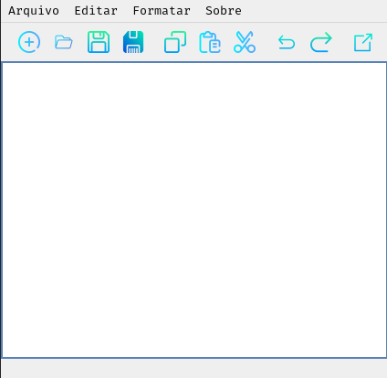

# Gufos - Simples editor de texto.

> Status: Em desenvolvimento. 

## Gufos é o nome desse simples e leve editor de texto gráfico.
Operações disponíveis: 
+ Criar arquivo
+ Abrir arquivo existente
+ Salvar arquivo com a extensão desejada
+ Escolher caminho para salvar arquivo
+ Botões com funções básicas como "copiar", "colar" e "recortar"

O programa é escrito em C++, utilizando o framework Qt.
Para utilizá-lo, basta clonar o repositório, compilar e executar.

### Requisitos
+ Compilador GCC.
+ GNU Make

### Modo de uso:
+ Clone o repositório com o comando "*git clone https://github.com/GuilhermeSantos99/Gufos*"
+ Na pasta clonada, execute o comando "*make*" para compilar o código.
+ Execute o comando *./Gufos* para executar o programa.
+ Realize as edições desejadas e para encerrar, clique no botão de "Fechar"

> Sou um entusiasta da programação em aprendizado e ainda tenho muito o que aprender e tenho muito o que melhorar nesse projeto, por isso, fico aberto à sugestões da comunidade.